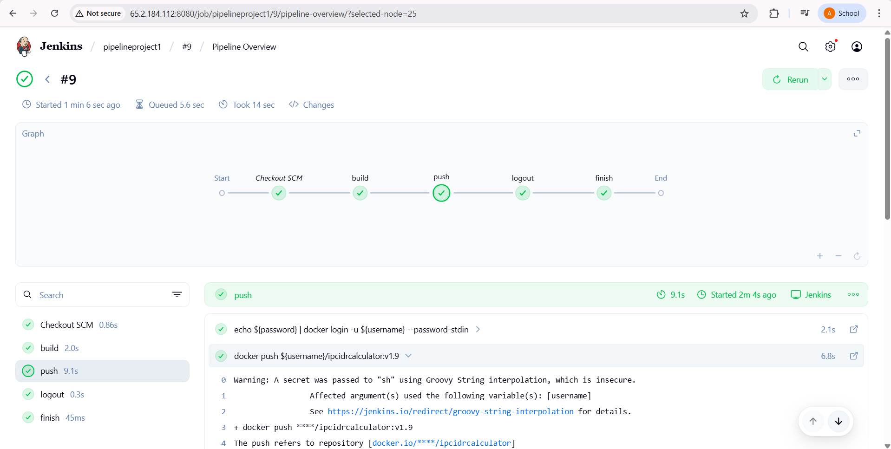

# IP/CIDR Calculator

A web-based tool designed for network engineers to perform IP and CIDR-related calculations, including converting CIDR to IP ranges, IP ranges to CIDR, generating AWS subnets, checking subnet overlaps, and summarizing routes. Built with Node.js, Express, and a responsive Tailwind CSS frontend, this project is optimized for usability and SEO.

## Features

- **CIDR to IP Range**: Convert CIDR notation (`192.168.1.0/24`) to detailed IP range information (netmask, wildcard bits, first/last IPs, total hosts).
- **IP to CIDR**: Convert an IP range (`192.168.1.0 - 192.168.1.255`) to its CIDR equivalent.
- **AWS Subnet Calculator**:  
  - Generate subnets from a CIDR block, respecting AWS’s 5 reserved IPs per subnet.
  - Supports equal-sized subnets or custom host counts with optional subnet naming (e.g., "Web Servers", "DB Cluster").
  - Enforces a minimum subnet size of `/29` (3 usable hosts) for AWS compatibility.
  - Download subnet results as a JSON file for easy sharing or documentation.
- **Subnet Overlap Checker**: Identify overlaps between multiple CIDR ranges.
- **Route Summarization**: Combine contiguous CIDR blocks into a single summarized CIDR.
- **Real-Time Validation**: Instant feedback on input errors with red borders and messages.
- **SEO Optimized**: Includes metadata, semantic HTML, and keyword-rich content for better search engine visibility.
- **Security Best Practices**:
  - Input validation and sanitization with `express-validator`.
  - JSON parsing with `body-parser` for safe request handling.
  - XSS protection with the `xss` library to prevent injection attacks.
  - helmet for securing http headers against XSS, clickjacking, etc.
  - cors for manages cross-origin requests safely.
  - express-rate-limit is to protect from abuse or brute-force attacks by limiting the number of requests within a certain time window.

## Usage

1. **Examples**:
   - **CIDR to IP Range**:
     - Input: `192.168.1.0/24`
     - Output: 
       ```
       CIDR Range: 192.168.1.0/24
       Netmask: 255.255.255.0
       Wildcard Bits: 0.0.0.255
       First IP: 192.168.1.0
       Last IP: 192.168.1.255
       Total Hosts: 256
       ```
   - **IP to CIDR**:
     - Input: `192.168.1.0 - 192.168.1.255`
     - Output: `192.168.1.0/24`
   - **AWS Subnet Calculator**:
     - Input: `10.0.0.0/16`, Custom Hosts: `[500, 100]`, Names: `["Web Servers", "DB Cluster"]`
     - Output: Web Servers: 10.0.0.0/23 (507 usable hosts), DB Cluster: 10.0.2.0/25 (123 usable hosts)
     - Download: `10.0.0.0-16_subnets.json`
   - **Subnet Overlap Checker**:
     - Input: `192.168.1.0/24`, `192.168.1.128/25`
     - Output: "192.168.1.0/24 overlaps with 192.168.1.128/25"
   - **Route Summarization**:
     - Input: `192.168.0.0/24`, `192.168.1.0/24`
     - Output: `192.168.0.0/23`

## Docker Usage

If you prefer to run the application using Docker, follow these steps:

1. **Pull the Docker Image**:
   ```bash
   docker pull beekeeper27/ip-cidr-calculator:v1.3
   ```

2. **Run the Container**:
   ```bash
   docker run -it -d -p 3003:2723 -e PORT=2723 --name=ipcidrcalculator beekeeper27/ip-cidr-calculator:v1.3
   ```
   The application will be accessible at `http://localhost:3003`.

3. **Check Running Containers**:
   ```bash
   docker ps
   ```

4. **Stop the Container**:
   ```bash
   docker stop <container-id>
   ```

## Jenkins Pipeline CI/CD Setup

1. **GitHub Webhook Configuration**
     - Go to your GitHub repo → Settings → Webhooks → Add webhook
     - Set the following values:
         - Payload URL: `http://<YOUR_JENKINS_IP>:8080/github-webhook/`
         - Content type: `application/json`
         - Trigger: `Only Just the push event`
       - Click **Add Webhook**
2. **Jenkins Credentials (DockerHub)**
     In Jenkins:
     - Go to `Manage Jenkins → Credentials`
     - Choose global or folder scope
     - Click Add Credentials:
         - Type: `Username with password`
         - ID: `{YOUR_ID}`
         - Username: Your DockerHub `username`
         - Password: Your DockerHub `access token or password`
3. **Jenkins Credentials (DockerHub)**
     - Create a new Pipeline job
     - Under Build Triggers, check:
          - ✅ GitHub hook trigger for GITScm polling
     - Under Pipeline section:
         - Definition: `Pipeline script from SCM`
         - SCM: `Git`
         - Repository URL:
           ```bash
           https://github.com/Anik-64/ip-cidr-calculator.git
           ```
         - Branches to build: `main` or `master`
         - Script Path: `Jenkinsfile`
      - Click **Save**  



## Contributing

1. Fork the repository.
2. Create a feature branch (`git checkout -b feature/new-feature`).
3. Commit changes (`git commit -m "Add new feature"`).
4. Push to the branch (`git push origin feature/new-feature`).
5. Open a pull request.

## Credits

- Built by `Anik Majumder`

## Contact

For questions or feedback, reach out to anikmajumder303@gmail.com or open an issue on GitHub.
